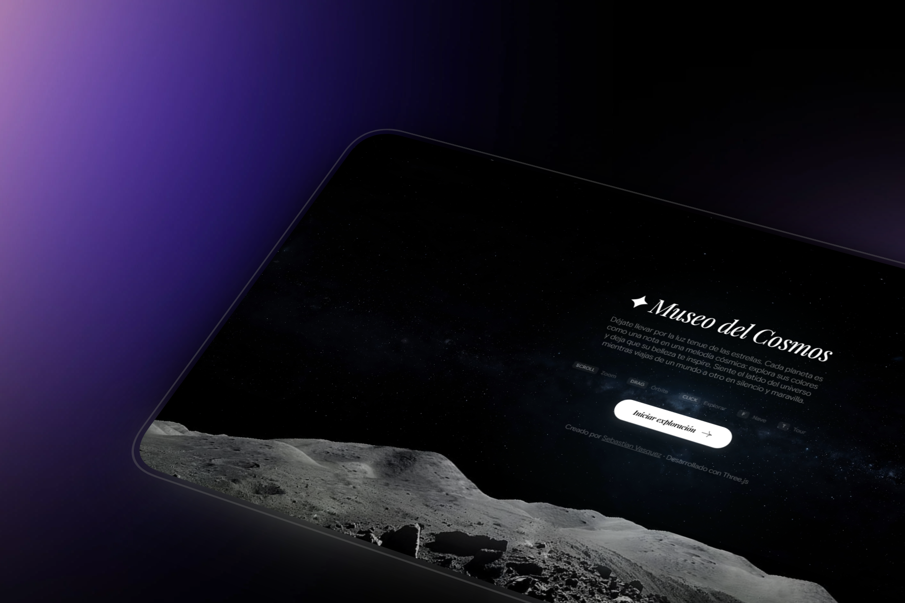

# ✦ Cosmic Explorer — The Museum of the Cosmos



Welcome to the **Museum of the Cosmos**, a digital sanctuary and a visual ode to the universe. This project is an interactive 3D experience designed to inspire peace, awe, and disconnection from the busy world. 

Through the intersection of code, art, and science, the Museum of the Cosmos invites its visitors on a serene journey across our solar system. Every line of code has been meticulously crafted as a brushstroke of light in the void, creating a space of profound stellar contemplation where the immensity of the universe feels closer to home.

## ✨ Features & Experience

- **Immersive 3D Exploration**: Freely navigate through beautifully rendered, high-fidelity planets using an intuitive set of controls.
- **Spaceship Flight Mode**: Pilot your own invisible spacecraft through the void using keyboard controls (WASD) and mouse aiming, giving you total freedom of movement.
- **Cinematic Interstellar Travel**: Double-click on any celestial body to engage the warp drive, triggering a stunning visual wormhole transition.
- **Contemplative Atmosphere**: Features a carefully crafted visual aesthetic with bloom effects, custom shaders, and an ambient soundtrack to transmit the serenity of infinite space.
- **Interactive Atlas & Planet Data**: Discover detailed astronomical statistics for each planet (Mass, Radius, Surface Temperature, Moons, Atmospheric Composition, and prominent space missions).
- **Screensaver Mode**: Let the universe flow by itself with a cinematic auto-orbit mode, perfect for ambient display.
- **Photo Mode**: Capture your favorite views of the cosmos with a built-in screenshot tool.

## 🛠️ Technology Stack

This pocket universe was hand-forged without heavy web frameworks, focusing purely on performance, raw WebGL capabilities, and real-time rendering beauty:

- **Three.js & WebGL**: Core 3D rendering engine.
- **GLSL Shaders**: Custom vertex and fragment shaders for procedural generation and post-processing effects.
- **Vanilla JavaScript**: Pure JS for game logic, UI interactions, and state management.
- **HTML5 & CSS3**: Elegant, responsive, and glassmorphic user interface.
- **GSAP**: Industry-standard animation library for buttery-smooth UI and camera transitions.
- **Lucide**: Clean and modern iconography.

## 🎮 Controls

- **Mouse Drag / Touch**: Orbit around the current celestial body.
- **Scroll Wheel**: Zoom in and out.
- **Click**: Select and focus on a planet.
- **Double Click**: Warp travel to the selected planet.
- **F**: Toggle Spaceship Flight Mode (Use WASD to move, Mouse to look).
- **T**: Start Auto-Tour Mode.
- **M**: Toggle Cosmic Melody (Background Music).
- **P**: Capture a photo (Screenshot).
- **1-9**: Quick-jump to planets.

## 🚀 Running Locally

This project requires no build steps or bundlers. However, to bypass CORS restrictions when loading textures in WebGL, you must run it through a local web server.

1. Clone the repository:
   ```bash
   git clone https://github.com/sebastianvasquezechavarria1234/cosmos-museum.git
   ```
2. Navigate to the directory:
   ```bash
   cd cosmos-museum
   ```
3. Start a local server. If you have Node.js installed, you can use `npx`:
   ```bash
   npx serve .
   ```
   Or using Python:
   ```bash
   python -m http.server 8000
   ```
4. Open your browser and navigate to `http://localhost:3000` (or the port provided by your server).

## 👨‍💻 About the Author

Created by **Sebastian Vasquez**, a software developer and space enthusiast passionate about creating digital experiences that merge technical complexity with artistic vision. 

*"Let yourself be carried away by the faint light of the stars and feel the heartbeat of the universe as you travel from one world to another in silence and wonder."*
